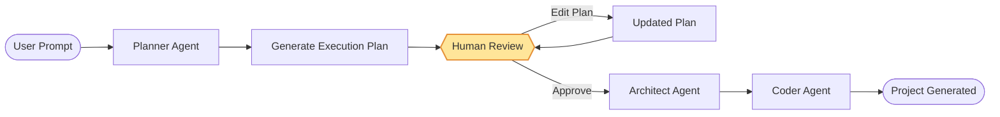
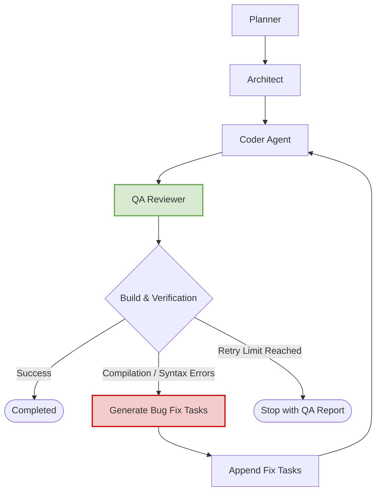

# 🤖 AgentBuilder

**AgentBuilder** is an autonomous AI software engineer built with **LangGraph** that turns natural language requirements into complete, production-ready applications.

Rather than behaving like a traditional code generator that spits out isolated snippets, AgentCrafter coordinates a team of specialized AI agents that work together through a structured software development workflow. Starting from a simple prompt, it analyzes requirements, forms a development strategy, designs the project architecture, generates source code, verifies the implementation, and iteratively resolves issues until a working codebase is delivered.

The system follows an **agentic software development lifecycle**, where each AI agent owns a specific engineering role — from planning and architecture to implementation and quality assurance. It also introduces **Human-in-the-Loop (HITL)** approval, letting developers review and adjust the generated project plan before any code is written, so you retain full control over the final outcome.

> **Authored by Shashwat Tripathi, IIT Bombay**

## 🧠 How It Works

The system is organized as a pipeline of cooperating agents, each handling a distinct stage of the development process:

| Agent | Responsibility |
|---|---|
| **Planner** | Interprets the user's request and produces a high-level project plan |
| **Architect** | Converts the plan into concrete, ordered engineering tasks, each with the context needed to implement it |
| **Coder** | Executes each task — writing files, running tools, and building the project like a hands-on developer |
| **QA Reviewer** | Automatically verifies the project by compiling/running tests. If it detects errors, it creates bug-fix tasks and routes them back to the Coder for self-correction |

### Advanced Agentic AI Features

- **Human-in-the-Loop (HITL) Plan Approval**: Execution pauses after the Planner finishes, letting you review, edit, and approve the generated plan (name, description, features list, and file structure) directly in the UI before code generation begins.



- **QA Reviewer Agent & Self-Correction Loop**: An automated code review loop where the QA Reviewer Agent verifies the implementation. If syntax or compilation errors are found, it creates bug-fix tasks and routes them back to the Coder, up to a predefined loop limit, to ensure higher code quality.



## 🛠 Tech Stack

| Category | Technologies |
|----------|--------------|
| **Language** | Python, JavaScript, HTML, CSS |
| **AI Framework** | LangGraph, LangChain |
| **LLM Provider** | Groq |
| **Backend** | FastAPI |
| **Data Validation** | Pydantic |
| **Frontend** | Vanilla JavaScript |
| **Syntax Highlighting** | PrismJS |
| **Dependency Manager** | uv |
| **ASGI Server** | Uvicorn |
| **Environment Management** | python-dotenv |
| **Development Workflow** | Multi-Agent Architecture, Human-in-the-Loop, Self-Correcting AI Agents |

## 📋 Requirements

Before running the project, make sure you have:

- **uv** — a fast Python package/dependency manager. Follow the [official install guide](https://docs.astral.sh/uv/getting-started/installation/) if you don't already have it.
- A **Groq account** with an active API key. You can generate one from the [Groq console](https://console.groq.com/keys).

## ⚡ Setup

1. **Create and activate a virtual environment**
   ```bash
   uv venv
   ```
   - macOS / Linux:
     ```bash
     source .venv/bin/activate
     ```
   - Windows PowerShell:
     ```powershell
     .\.venv\Scripts\Activate.ps1
     ```
   - Windows CMD:
     ```cmd
     .\.venv\Scripts\activate.bat
     ```

2. **Install project dependencies**
   ```bash
   uv pip install -r pyproject.toml
   ```

3. **Configure environment variables**

   Copy `.sample_env` to `.env` and fill in the required values (including your Groq API key):
   - macOS / Linux:
     ```bash
     cp .sample_env .env
     ```
   - Windows PowerShell:
     ```powershell
     Copy-Item .sample_env .env
     ```
   - Windows CMD:
     ```cmd
     copy .sample_env .env
     ```

4. **Run the application**

   AgentCrafter can be run as a web dashboard or as a standard Command Line Interface (CLI):

   - **Option A: Web Dashboard (Recommended)**
     Run the FastAPI server:
     ```bash
     uvicorn server:app --reload
     ```
     Once started, navigate to **http://127.0.0.1:8000** in your browser.

   - **Option B: CLI Interface**
     Run the CLI runner directly:
     ```bash
     python main.py
     ```

## 🎨 Web Dashboard Features

- **Real-Time Pipeline Tracking**: Visual status indicators pulse and show progress across the Planner, Architect, and Coder nodes.
- **Human-in-the-Loop Plan Editor**: Review, edit, and approve the AI-generated project plan before code generation begins.
- **Interactive Tasks Checklist**: Displays tasks formulated by the Architect, checking them off automatically as the Coder implements them.
- **Integrated File Tree & Code Viewer**: Inspect generated source files inside the browser as they are written by the agent, powered by PrismJS syntax highlighting.
- **Agent Output Log Terminal**: A glowing black-screen console streaming coder thoughts, tool executions, and system events.
- **Project Command Shell**: Direct console access allowing you to run dev servers, build projects, or execute tests inside the generated project folder with live streamed stdout/stderr.

## 💡 Try It Out

Once running, here are a few prompts to get a feel for what AgentCrafter can build:

- "Build a weather dashboard that fetches and displays live forecasts."
- "Create a simple notes-taking app with the ability to add, edit, and delete entries."
- "Set up a URL shortener service with FastAPI and SQLite."
</content>
